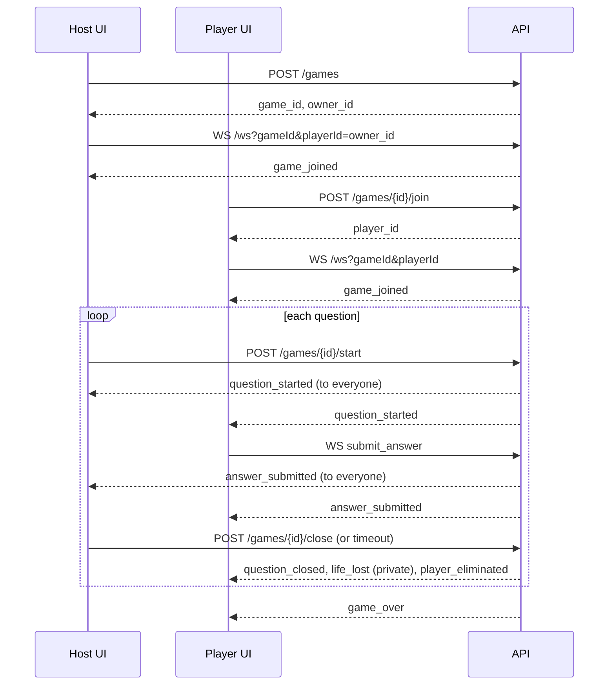

# Frontend integration guide

This guide is for anyone building a user interface on top of `quizz-backend`. It explains how to reach the API, authenticate, manage the question catalog, run a game over HTTP and WebSocket, and handle every event and error. It is self-contained: the [README](../README.md) remains the reference for running and configuring the backend.

The dev tool in [`tools/test-ui`](../tools/test-ui) is a working (if spartan) client that exercises everything described here. When in doubt, look at how it does it.

## Contents

1. [Concepts](#1-concepts)
2. [Connecting to the backend](#2-connecting-to-the-backend)
3. [Authentication](#3-authentication)
4. [Conventions](#4-conventions)
5. [Catalog: question lists, questions, themes](#5-catalog-question-lists-questions-themes)
6. [Running a game](#6-running-a-game)
7. [WebSocket protocol](#7-websocket-protocol)
8. [Client state and reconnection](#8-client-state-and-reconnection)
9. [Error reference](#9-error-reference)
10. [TypeScript types](#10-typescript-types)
11. [Known gaps and workarounds](#11-known-gaps-and-workarounds)
12. [Integration checklist](#12-integration-checklist)

## 1. Concepts

### Actors

Every request is made by an **actor**: an ID and a type.

| Actor type | Can                                                                                  |
|------------|--------------------------------------------------------------------------------------|
| `admin`    | create public question lists, edit any public list, manage global themes, play       |
| `user`     | create private question lists, edit their own private lists, play                    |

Both types can create, join and play games.

### Catalog vs game

- The **catalog** is persistent: question lists, their questions and themes. It is managed with plain REST endpoints.
- A **game** is created from a question list. Its questions are **copied** at creation: editing the list afterwards does not affect running games. Games live in the server's memory only (see [known gaps](#11-known-gaps-and-workarounds)).

### Roles inside a game

- The **host** is the actor who created the game. Only the host can start and close questions.
- The host automatically gets a **player** too (the "owner player", `owner_id` in the create response). **The host plays**: if the owner player does not answer, it loses a life like anyone else. A host-only screen that never answers will see its owner player lose lives and eventually be eliminated.
- Other **players** join the game. Each player is bound to the actor who created it: only that actor can open the player's WebSocket. One actor may own several players (useful for local multiplayer on one device).

### Game rules

- Every player starts with the same number of lives (`initial_lives`, default 3 on the server).
- The host starts a question; players answer over WebSocket; the question is closed by the host or automatically after `answer_timeout_seconds` (if the game has one).
- On close, every active player who answered wrong **or did not answer** loses one life. At 0 lives a player is eliminated.
- The game ends when a question is closed and:

  | `reason`               | Condition                                             | Winner                                                   |
  |------------------------|-------------------------------------------------------|----------------------------------------------------------|
  | `last_player_standing` | exactly one active player is left                     | that player                                              |
  | `all_eliminated`       | every remaining player lost their last life at once   | none                                                     |
  | `no_more_questions`    | the last question was played, 2+ players survive      | the survivor with the most lives; none on a tie (draw)   |

## 2. Connecting to the backend

### Same origin is required

**The API does not send CORS headers.** A browser page served from another origin cannot call it with `fetch`, and could not send the session cookie anyway. Serve your UI and the API under the same origin, typically with a reverse proxy:

| Path prefix | Forwarded to                                                                      |
|-------------|-----------------------------------------------------------------------------------|
| `/api/*`    | the API, **with the `/api` prefix removed** (the API routes start at `/`)          |
| `/ws`       | the API's `/ws`, with WebSocket upgrade enabled                                   |

The prefix is only a convention of the test UI; any prefix works as long as the proxy strips it. Examples:

**Vite (development)**, as in [`tools/test-ui/vite.config.ts`](../tools/test-ui/vite.config.ts):

```ts
server: {
  proxy: {
    '/api': { target: 'http://localhost:8080', rewrite: p => p.replace(/^\/api/, ''), changeOrigin: true },
    '/ws':  { target: 'ws://localhost:8080', ws: true, changeOrigin: true },
  },
}
```

**nginx (production)**:

```nginx
location /api/ {
    proxy_pass http://quizz-api:8080/;     # trailing slash strips /api
}
location /ws {
    proxy_pass http://quizz-api:8080/ws;
    proxy_http_version 1.1;
    proxy_set_header Upgrade $http_upgrade;
    proxy_set_header Connection "upgrade";
    proxy_read_timeout 120s;               # longer than the 54 s server ping
}
```

In the rest of this guide, paths are the API's own paths (`/games`, `/ws`...). Add your proxy prefix when calling them.

### Health check

```
GET /health  →  200 { "status": "ok", "uptime": "1m23s" }
```

No authentication. Useful for a "backend unreachable" banner.

## 3. Authentication

The backend runs in one of two modes, chosen by its `OIDC_ENABLED` setting. Your UI can detect the mode at startup with `GET /auth/me` (see [bootstrap](#bootstrap-sequence)).

### OIDC mode (production)

The backend implements the OAuth2 Authorization Code flow itself; the browser only follows redirects. There is no token to handle in JavaScript: the session is an HttpOnly cookie.

1. **Login**: navigate the whole page (not `fetch`) to `GET /auth/login`. The browser is redirected to the identity provider, then back to the API's `/auth/callback`, which sets the `quizz_session` cookie and redirects to the backend's configured `OIDC_FRONTEND_URL` (your UI's URL).
2. **Requests**: the cookie is sent automatically on same-origin requests and on the WebSocket handshake. Nothing to add.
3. **Session end**: the session lasts 24 hours. Any protected call then answers `401`: send the user to `/auth/login` again.
4. **Logout**: `POST /auth/logout` clears the cookie and answers `200 { "status": "logged out" }`. It does not end the session at the identity provider, so the next login may be immediate.

The actor ID is the provider's `sub`. The actor type is `admin` when the provider's role claim contains the configured admin role, `user` otherwise. Name and email come from the ID token.

### Dev mode (local development only)

There is no login. The actor is read from two headers on every HTTP request:

| Header               | Values          | Default     |
|----------------------|-----------------|-------------|
| `X-Debug-Actor-Type` | `admin`, `user` | `user`      |
| `X-Debug-Actor-Id`   | any string      | `anonymous` |

Browsers cannot set headers on a WebSocket, so pass the same values as `debugActorType` and `debugActorId` query parameters on the `/ws` URL. Dev mode trusts the client completely: never expose it publicly. In OIDC mode these headers and parameters are ignored, so a UI can always send them.

### Bootstrap sequence

```ts
const res = await fetch('/api/auth/me', { headers: debugHeaders() })
if (res.status === 401) {
  // OIDC mode, not logged in: show a login button linking to /api/auth/login
} else {
  const me = await res.json()
  // me = { sub, name, email, actor_type: 'admin' | 'user', oidc_enabled: boolean }
  // oidc_enabled === false: dev mode, offer an actor picker and send the debug headers
}
```

`GET /auth/login` and `GET /auth/callback` answer `404` in dev mode.

## 4. Conventions

- **Bodies** are JSON (`Content-Type: application/json` on requests with a body).
- **IDs** are opaque strings (UUIDs today). Do not parse them.
- **Timestamps** are RFC 3339 strings with a time zone offset, e.g. `2026-09-26T11:32:08.316641823Z`. Parse them, do not compare them as strings.
- **Lists** are returned as JSON arrays, `[]` when empty. Some fields documented as `string[] | null` are `null` when empty; treat `null` as an empty array.
- **Errors** always have this shape, with an HTTP status in the 4xx/5xx range:

  ```json
  { "error": "human readable message", "code": "machine_readable_code" }
  ```

  `code` is only present on errors a client is expected to handle programmatically (see [error reference](#9-error-reference)). Show `error` to users only as a fallback; switch on `status` and `code`.
- `401` means "not authenticated" (OIDC mode only), `403` "authenticated but not allowed", `404` "unknown or not visible", `409` "the game is not in the right state for this action".

## 5. Catalog: question lists, questions, themes

### Permissions (for showing or hiding controls)

| Action                                   | Public list         | Private list       |
|------------------------------------------|---------------------|--------------------|
| create the list                          | `admin` only        | `user` only        |
| read the list, its questions and themes  | everyone            | its owner only     |
| add or update questions, manage its themes | any `admin`       | its owner only     |
| start a game with it                     | everyone            | its owner only     |

Global themes: readable by everyone, managed by `admin` only.

The backend enforces all of these rules (`403` otherwise); the table only helps you avoid showing buttons that will fail.

### Question lists

```
POST /question-lists
{ "name": "General culture", "description": "optional", "visibility": "public" | "private" }
→ 201 QuestionList
  400 missing name, invalid visibility      403 visibility not allowed for this actor type

GET /question-lists/public   → 200 QuestionList[]   (newest first)
GET /question-lists/private  → 200 QuestionList[]   the current user's private lists; 403 for admins
GET /question-lists/{id}     → 200 QuestionList     403 / 404
```

```json
{
  "id": "4099ace9-...", "name": "General culture", "description": "",
  "visibility": "public", "owner_type": "admin", "owner_id": "",
  "created_at": "2026-09-26T10:27:47Z", "updated_at": "2026-09-26T10:27:47Z"
}
```

`owner_id` is empty for public lists. Lists cannot be renamed or deleted through the API.

### Questions

```
GET /question-lists/{id}/questions                 → 200 Question[]  ordered by order_index
GET /question-lists/{id}/questions?theme_id=<id>   → only questions of that theme
GET /question-lists/{id}/questions?theme_id=none   → only questions without theme

POST /question-lists/{id}/questions                → 201 { "question_id": "..." }
PUT  /question-lists/{id}/questions/{questionId}   → 200 Question
```

Body of `POST` and `PUT`:

```json
{
  "text": "Capital of France?",
  "options": [ { "id": "a", "text": "London" }, { "id": "b", "text": "Paris" } ],
  "correct_option_id": "b",
  "theme_id": "optional theme id"
}
```

- At least 2 options. Option IDs must be unique within the question; an empty ID is generated by the server, but then you cannot reference it in `correct_option_id`, so **always send your own option IDs** (`a`, `b`, `c`...).
- `correct_option_id` must match one of the options.
- `theme_id` is optional. Omit it, or send `null` or `""`, for no theme. On `PUT` this **removes** the current theme: `PUT` replaces text, options, correct option and theme. It keeps the question's position.
- Questions cannot be reordered or deleted.

A question as returned:

```json
{
  "id": "...", "question_list_id": "...", "text": "Capital of France?",
  "options": [ { "id": "a", "text": "London" }, { "id": "b", "text": "Paris" } ],
  "correct_option_id": "b", "order_index": 0,
  "theme": { "id": "...", "name": "Geography", "scope": "global" }
}
```

`theme` is `null` when the question has none.

> **Do not load catalog questions in a player's UI.** They include `correct_option_id`. Players receive questions through the WebSocket, without the answer. Catalog screens are for editors.

### Themes

Themes categorize questions. A theme has a **scope**:

- `global`: managed by admins at `/themes`, usable by questions of any list;
- `list`: a custom theme of one list, managed at `/question-lists/{id}/themes`, usable only by that list's questions.

A question references at most one theme. When building a theme picker for a question of list `L`, offer the global themes **plus** the themes of `L`:

```ts
const [globals, custom] = await Promise.all([
  get('/themes'),
  get(`/question-lists/${listId}/themes`),
])
```

Both scopes offer the same operations:

```
GET    /themes                     GET    /question-lists/{id}/themes                → 200 Theme[] (by name)
POST   /themes                     POST   /question-lists/{id}/themes                → 201 Theme
GET    /themes/{themeId}           GET    /question-lists/{id}/themes/{themeId}      → 200 Theme
PUT    /themes/{themeId}           PUT    /question-lists/{id}/themes/{themeId}      → 200 Theme
DELETE /themes/{themeId}           DELETE /question-lists/{id}/themes/{themeId}      → 204 (no body)
```

Body of `POST` and `PUT`: `{ "name": "Geography", "description": "optional" }`.

```json
{
  "id": "...", "scope": "list", "question_list_id": "...",
  "name": "Retro games", "description": "",
  "created_at": "...", "updated_at": "..."
}
```

- `question_list_id` is absent on global themes.
- Names are trimmed, required, at most 100 characters, and unique per scope ignoring case (`409` with code `theme_name_taken`). The same name may exist globally and in several lists.
- A theme is only reachable through its own scope: a list theme is `404` on `/themes` and on another list's URL.
- Deleting a theme never fails because it is used: its questions simply lose their theme. Refresh any question list you display.
- Assigning a theme from another list to a question gives `400 theme_from_another_list`; an unknown theme gives `400 theme_not_found`.
- `DELETE` answers `204` with an empty body: do not call `response.json()` on it.

## 6. Running a game

### Overview



### Game states

```
waiting ──start──► running ──(last close)──► finished
                     │  question_open: true  (between start and close)
                     │  question_open: false (between close and next start)
```

| State                         | Host can         | Players can                  |
|-------------------------------|------------------|------------------------------|
| `waiting`                     | start            | join                         |
| `running`, question open      | close            | answer (once per question)   |
| `running`, question closed    | start next       | wait                         |
| `finished`                    | nothing          | nothing                      |

Joining is only possible while `waiting`.

### 1. Create the game (host)

```
POST /games
{
  "owner_name": "Alice",
  "question_list_id": "...",
  "initial_lives": 3,              // optional, >= 1
  "answer_timeout_seconds": 20     // optional, 0 or absent = no timeout
}
→ 201 { "game_id": "...", "owner_id": "...", "question_list_id": "...", "total_questions": 10 }
```

Errors: `400` (missing field, `initial_lives` < 1, negative timeout, `code: empty_question_list`), `403` (another user's private list), `404` (unknown list).

Store `game_id` and `owner_id`: the host's own player ID. Then open the host's WebSocket with `playerId=owner_id` (section 7): the host receives events like every player, including timeout closes that it did not trigger.

### 2. Invite and join (players)

Share `game_id` with players (link, QR code...). Each player:

```
POST /games/{gameId}/join
{ "player_name": "Bob" }
→ 200 { "game_id": "...", "player_id": "..." }
```

Errors: `400` (missing name), `404` (unknown game), `409` (game already started or finished). Store `player_id`, then open the WebSocket.

**Lobby:** there is no "player joined" event. To show who is in the lobby, poll `GET /games/{id}` (every 1 or 2 seconds is fine) until the game starts.

```
GET /games/{id}
→ 200 {
  "id": "...", "status": "waiting" | "running" | "finished",
  "owner_id": "...", "question_list_id": "...",
  "players": [ { "id": "...", "name": "Bob", "lives": 3, "active": true } ],
  "current_q_idx": -1, "question_open": false,
  "total_questions": 10, "remaining_questions": 10,
  "end_reason": ""
}
```

`players` has no guaranteed order: sort it yourself. `active` is `false` once a player is eliminated. `current_q_idx` is the index of the last started question (`-1` before the first). `remaining_questions` counts questions not started yet. `end_reason` is empty until the game is finished.

### 3. Start a question (host)

```
POST /games/{id}/start  →  200 { "status": "question started" }
```

Errors: `403` (not the host), `409` with `code`:

| `code`              | Meaning                                         | Suggested UI                         |
|---------------------|-------------------------------------------------|--------------------------------------|
| `question_open`     | the current question has not been closed        | enable "close" instead of "next"     |
| `no_more_questions` | the last question has already been played       | show the results screen              |
| `game_finished`     | the game ended by elimination                   | show the results screen              |

The question itself is delivered to everyone (host included) by the `question_started` WebSocket event, not by this response.

### 4. Answer (players)

Send over the WebSocket:

```json
{ "type": "submit_answer", "data": { "question_id": "<from question_started>", "option_id": "b" } }
```

- Only the first answer of a player to the open question counts.
- Answers are **not acknowledged individually**. Treat your own `answer_submitted` event (with your `player_id`) as the confirmation.
- Rejected answers (question already closed, wrong `question_id`, second answer, eliminated player) are silently ignored. Disable the answer buttons once an answer is sent, when the player is eliminated, and when `question_closed` arrives.
- Correctness is not revealed until `question_closed`.

### 5. Close a question (host, or timeout)

```
POST /games/{id}/close
→ 200 {
  "life_lost": ["player-id", ...] | null,
  "eliminated": ["player-id", ...] | null,
  "remaining_questions": 3,
  "game_over": false,
  "reason": "",            // set when game_over
  "winner": "",            // player id, "" when no winner
  "survivors": null        // player ids, set when game_over
}
```

Errors: `403` (not the host), `409` `code: no_active_question` (already closed, by hand or by the timeout), `409` `code: game_not_running`.

If the game has a timeout, the server closes the question by itself when it expires. The effects and events are identical to a manual close. A host UI should therefore **drive its screens from WebSocket events**, not from the HTTP responses, and treat `409 no_active_question` on close as "already done".

### 6. Show results

After each `question_closed`, refresh the scoreboard with `GET /games/{id}` (lives and eliminations of every player). On `game_over`, show `reason`, the winner (map `winner_id` to a name with `GET /games/{id}`) and `survivors`. A `no_more_questions` game with an empty `winner_id` and several survivors is a draw.

Finished games stay available for about 10 minutes (backend setting `GAME_FINISHED_TTL`), then `GET /games/{id}` answers `404` and open WebSockets are closed. Unfinished games inactive for 2 hours (`GAME_IDLE_TTL`) are removed the same way.

## 7. WebSocket protocol

### Connecting

```ts
const params = new URLSearchParams({ gameId, playerId })
// Dev mode only (ignored in OIDC mode):
params.set('debugActorType', actor.type)
params.set('debugActorId', actor.id)
const ws = new WebSocket(`${location.protocol === 'https:' ? 'wss' : 'ws'}://${location.host}/ws?${params}`)
```

The actor (session cookie, or debug parameters) must be the one that created `playerId`. The handshake fails with `400` (missing parameter), `401` (OIDC mode, no valid session), `403` (player not in this game, or owned by another actor) or `404` (unknown or evicted game). **Browsers do not expose the handshake status**: you only get an `error` then a `close` event with code `1006`. To tell the causes apart, call `GET /games/{id}` before connecting, and check that your `playerId` is in `players`.

The server pings every 54 seconds and drops the connection if no pong comes back within 60 seconds. Browsers answer pings automatically; you have nothing to do. Client messages are limited to 4 KB.

**One connection per player.** Opening a second WebSocket for the same player (new tab, page reload) closes the previous one. The newest connection receives the events.

### Server messages

Every message is a JSON object `{ "type": string, "payload": object }`. Ignore unknown types: new events may be added.

| `type`              | Sent to        | When                                             |
|---------------------|----------------|--------------------------------------------------|
| `game_joined`       | that player    | right after the connection opens                 |
| `question_started`  | everyone       | the host started a question                      |
| `answer_submitted`  | everyone       | a player answered (correctness hidden)           |
| `question_closed`   | everyone       | the question was closed (host or timeout)        |
| `life_lost`         | that player    | this player lost a life on that question         |
| `player_eliminated` | everyone       | a player reached 0 lives                         |
| `game_over`         | everyone       | the game ended                                   |

After a close, events arrive in this order: `question_closed`, then `life_lost` (only to the players concerned), then `player_eliminated` (one per eliminated player), then `game_over` if the game ended.

Payloads:

```jsonc
// game_joined
{ "game_id": "...", "player_id": "...", "status": "waiting", "question_list_id": "...", "total_questions": 10 }

// question_started
{
  "question_id": "...",
  "index": 0,                     // 0-based
  "total": 10,
  "is_last": false,               // true on the last question of the list
  "text": "Capital of France?",
  "options": [ { "id": "a", "text": "London" }, { "id": "b", "text": "Paris" } ],
  "theme": { "id": "...", "name": "Geography", "scope": "global" },   // or null
  "answer_timeout_seconds": 20    // only present when the game has a timeout
}

// answer_submitted
{ "player_id": "...", "question_id": "..." }

// question_closed
{ "question_id": "...", "correct_option_id": "b", "remaining_questions": 9 }

// life_lost (private)
{ "player_id": "...", "lives_left": 2 }

// player_eliminated
{ "player_id": "..." }

// game_over
{ "reason": "no_more_questions", "winner_id": "", "survivors": ["...", "..."] }
```

**Countdown:** when `answer_timeout_seconds` is present, start a local countdown when `question_started` arrives. It is approximate (network delay); the server's timer is authoritative and `question_closed` ends the question.

### Client messages

Only one type exists:

```json
{ "type": "submit_answer", "data": { "question_id": "...", "option_id": "..." } }
```

Invalid or unknown messages are ignored.

## 8. Client state and reconnection

### What to store on the client

Persist per game (for example in `sessionStorage`, keyed by `game_id`):

- `game_id`;
- your `player_id` (and `owner_id` if you are the host);
- whether you are the host.

**The backend cannot tell you which player is yours later:** `GET /games/{id}` does not expose which actor owns which player. If the client loses `player_id`, the player cannot rejoin (and cannot join again once the game has started).

### After a page reload or a network drop

1. `GET /games/{id}`. On `404`, the game is gone (evicted, or the server restarted): go back to the home screen.
2. If your `player_id` is not in `players`, clear the stored state.
3. Reopen the WebSocket with the same `player_id`. It replaces any previous connection.
4. Rebuild the screen from the `GET` response: `status`, `question_open`, `players` (lives, active), `end_reason`.

Reconnect with a backoff (for example 1 s, 2 s, 5 s, then every 10 s) when the socket closes while the game is not finished.

**Limitation:** the current question (text and options) is only sent in `question_started`. A client that reconnects while `question_open` is `true` cannot display it and must wait for the next question. Show a "question in progress, wait for the next one" message.

### Server restarts

Games are kept in memory only. A backend restart ends every game: all game endpoints then answer `404` for the old IDs. The catalog is not affected.

## 9. Error reference

Errors with a stable `code`:

| Status | `code`                     | Where                                  | Meaning                                              |
|--------|----------------------------|----------------------------------------|------------------------------------------------------|
| 400    | `empty_question_list`      | `POST /games`                          | the list has no questions                            |
| 400    | `theme_not_found`          | question create / update               | unknown `theme_id`                                   |
| 400    | `theme_from_another_list`  | question create / update               | the theme belongs to another list                    |
| 409    | `theme_name_taken`         | theme create / update                  | name already used in this scope                      |
| 409    | `question_open`            | `POST /games/{id}/start`               | close the current question first                     |
| 409    | `no_more_questions`        | `POST /games/{id}/start`               | the list is exhausted, the game is finished          |
| 409    | `game_finished`            | `POST /games/{id}/start`               | the game ended by elimination                        |
| 409    | `no_active_question`       | `POST /games/{id}/close`               | no question open (already closed, maybe by timeout)  |
| 409    | `game_not_running`         | `POST /games/{id}/close`               | the game has not started, or is finished             |

Errors without code, by status:

| Status | Typical causes                                                                            |
|--------|-------------------------------------------------------------------------------------------|
| 400    | invalid JSON, missing or invalid field (the `error` message says which)                   |
| 401    | OIDC mode: no session or expired session; redirect to `/auth/login`                       |
| 403    | not allowed: wrong actor type, not the list owner, not the host, not the player's actor   |
| 404    | unknown or invisible resource, evicted game                                               |
| 409    | `POST /games/{id}/join` on a game that already started                                    |
| 500    | unexpected server error; retry later                                                      |

## 10. TypeScript types

```ts
export type ActorType = 'admin' | 'user'

export interface Me {
  sub: string
  name: string
  email: string
  actor_type: ActorType
  oidc_enabled: boolean
}

export interface ApiError {
  error: string
  code?: string
}

// ── Catalog ──
export interface QuestionList {
  id: string
  name: string
  description: string
  visibility: 'public' | 'private'
  owner_type: ActorType
  owner_id: string
  created_at: string
  updated_at: string
}

export type ThemeScope = 'global' | 'list'

export interface Theme {
  id: string
  scope: ThemeScope
  question_list_id?: string
  name: string
  description: string
  created_at: string
  updated_at: string
}

export interface ThemeRef {
  id: string
  name: string
  scope: ThemeScope
}

export interface Option {
  id: string
  text: string
}

export interface Question {
  id: string
  question_list_id: string
  text: string
  options: Option[]
  correct_option_id: string
  order_index: number
  theme: ThemeRef | null
}

// ── Games ──
export type GameStatus = 'waiting' | 'running' | 'finished'
export type GameOverReason = 'last_player_standing' | 'all_eliminated' | 'no_more_questions'

export interface CreateGameResponse {
  game_id: string
  owner_id: string
  question_list_id: string
  total_questions: number
}

export interface Game {
  id: string
  status: GameStatus
  owner_id: string
  question_list_id: string
  players: { id: string; name: string; lives: number; active: boolean }[]
  current_q_idx: number
  question_open: boolean
  total_questions: number
  remaining_questions: number
  end_reason: GameOverReason | ''
}

export interface CloseQuestionResponse {
  life_lost: string[] | null
  eliminated: string[] | null
  remaining_questions: number
  game_over: boolean
  reason: GameOverReason | ''
  winner: string
  survivors: string[] | null
}

// ── WebSocket ──
export type ServerEvent =
  | { type: 'game_joined'; payload: { game_id: string; player_id: string; status: GameStatus; question_list_id: string; total_questions: number } }
  | { type: 'question_started'; payload: { question_id: string; index: number; total: number; is_last: boolean; text: string; options: Option[]; theme: ThemeRef | null; answer_timeout_seconds?: number } }
  | { type: 'answer_submitted'; payload: { player_id: string; question_id: string } }
  | { type: 'question_closed'; payload: { question_id: string; correct_option_id: string; remaining_questions: number } }
  | { type: 'life_lost'; payload: { player_id: string; lives_left: number } }
  | { type: 'player_eliminated'; payload: { player_id: string } }
  | { type: 'game_over'; payload: { reason: GameOverReason; winner_id: string; survivors: string[] } }

export interface SubmitAnswer {
  type: 'submit_answer'
  data: { question_id: string; option_id: string }
}
```

A minimal fetch helper that handles the conventions above:

```ts
export class HttpError extends Error {
  constructor(public status: number, public body: ApiError | null) {
    super(body?.error ?? `HTTP ${status}`)
  }
  get code() { return this.body?.code }
}

export async function api<T>(method: string, path: string, body?: unknown): Promise<T> {
  const res = await fetch(`/api${path}`, {
    method,
    headers: {
      ...(body !== undefined ? { 'Content-Type': 'application/json' } : {}),
      ...debugHeaders(), // X-Debug-Actor-* in dev mode, {} otherwise
    },
    body: body !== undefined ? JSON.stringify(body) : undefined,
  })
  const data = res.status === 204 ? null : await res.json().catch(() => null)
  if (res.status === 401) redirectToLogin()
  if (!res.ok) throw new HttpError(res.status, data)
  return data as T
}
```

## 11. Known gaps and workarounds

| Gap                                                          | Workaround                                                                   |
|--------------------------------------------------------------|------------------------------------------------------------------------------|
| No CORS support                                              | serve the UI and the API under one origin (reverse proxy)                    |
| No "player joined" event                                     | poll `GET /games/{id}` in the lobby                                          |
| No way to find "my player" from the server                   | persist `player_id` on the client                                            |
| Current question not recoverable after a reconnect           | wait for the next `question_started`                                         |
| No per-answer acknowledgment or rejection message            | use your own `answer_submitted` as confirmation; disable buttons locally     |
| Other players' lives only via `GET /games/{id}`              | refresh the scoreboard after each `question_closed`                          |
| Games lost on server restart                                 | handle `404` on game endpoints by returning to the home screen               |
| Catalog questions expose `correct_option_id`                 | never show catalog endpoints' data to players                                |
| No game listing or discovery endpoint                        | share `game_id` out of band (link, QR code)                                  |
| Lists cannot be renamed or deleted; questions cannot be reordered or deleted | none yet                                                      |

## 12. Integration checklist

- [ ] UI and API served under the same origin; `/ws` proxied with WebSocket upgrade.
- [ ] `GET /auth/me` at startup: login button on `401`, actor picker when `oidc_enabled` is `false`.
- [ ] Debug headers on HTTP and debug query parameters on `/ws` in dev mode only.
- [ ] Every error parsed as `{ error, code }`; `401` redirects to login; `204` not parsed.
- [ ] Permission-aware catalog screens (public vs private lists, global vs list themes).
- [ ] Theme picker offering global themes plus the list's own themes.
- [ ] Host screen connects its own WebSocket as `owner_id` and is driven by events.
- [ ] Lobby polls `GET /games/{id}`; players sorted client-side.
- [ ] Answer buttons disabled after answering, on elimination and on `question_closed`.
- [ ] Countdown from `answer_timeout_seconds`; `409 no_active_question` on close treated as done.
- [ ] `question_open` / `is_last` / `remaining_questions` used to label "close", "next" and "results" actions.
- [ ] Results screen for all three `game_over` reasons, including the draw.
- [ ] `game_id` and `player_id` persisted; reconnection with backoff; `404` handled.
